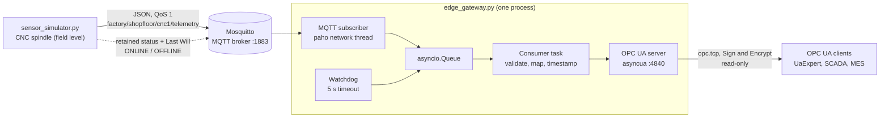

# Factory Edge Gateway Simulation: MQTT → OPC UA


[](https://github.com/PawanShetty-9/industrie40-telemetry-gateway/actions/workflows/ci.yml)


An Industrie 4.0 edge gateway in Python. It collects machine telemetry over **MQTT**
and serves it through a typed, self-describing **OPC UA information model** to
SCADA, MES or any OPC UA client (e.g. UaExpert).

The data comes from a simulated CNC spindle: temperature, speed and vibration
velocity. The gateway treats every MQTT message as untrusted, reports data quality
with standard OPC UA status codes and handles broker outages, crashed publishers and
malformed input without stopping.

It ships with a verification client, 20 automated tests and a CI pipeline, and deploys
either as a Docker Compose stack or as hardened systemd services on an edge device.

> 🇩🇪 **Deutsche Kurzfassung:** [siehe unten](#-deutsche-kurzfassung)

---

## Architecture



| Component | Role |
|---|---|
| `sensor_simulator.py` | Simulates a CNC spindle and publishes one JSON sample per second. RPM ramps between machining set-points, temperature follows with a first-order thermal lag, and vibration rises with speed. Announces `ONLINE`/`OFFLINE` with a retained MQTT Last Will. |
| `opc_ua_server.py` | Builds the OPC UA information model and server configuration: security policies, certificate, endpoints. Runs standalone for inspecting the model, or is imported by the gateway. |
| `edge_gateway.py` | Subscribes to MQTT, validates each payload and writes the values into the OPC UA nodes with source timestamp and status code. Hosts the OPC UA server in the same process. |
| `opc_client.py` | Verification client that behaves like a generic SCADA client. It knows only the namespace URI and the machine's browse path, and discovers signals, units and ranges at runtime. Live view, or `--check` smoke test with exit codes for CI and deployment. |

### Inside the gateway

- The **paho network thread** only receives messages and hands them to the asyncio
  event loop with `call_soon_threadsafe`. No OPC UA work happens on that thread.
- A **single consumer task** performs every node write. Samples, status changes and
  watchdog timeouts are serialized, so a client never sees a half-updated machine.
- The **watchdog** feeds the same queue, so it can never race with a data sample.
- The queue is **bounded** (1000 events). If the OPC UA side ever stalls, new
  messages are dropped and counted instead of exhausting memory.

## Why MQTT *and* OPC UA?

The two protocols solve different problems, and the gateway connects them.

| | MQTT | OPC UA |
|---|---|---|
| Strength | Lightweight transport from many devices to the edge | Semantic, secure access for IT/OT systems |
| Communication | Publish/subscribe through a broker: publishers don't know their consumers | Client/server with browsing, subscriptions and discovery |
| Data model | **None.** The payload is opaque bytes; meaning exists only by convention | **Rich.** Types, instances, units, ranges, quality, timestamps |
| Device presence | Retained messages and Last Will | Server and session diagnostics |
| Security | Delegated to TLS and broker ACLs | Built in: X.509 application certificates, signing, encryption, user tokens |
| Typical use | Sensors and gateways over unreliable networks | PLC, SCADA and MES integration; companion specs (umati, VDMA) |

- **MQTT** is a good fit for the field-to-edge link. It needs very little bandwidth,
  tolerates unstable networks and decouples senders from receivers.
- **OPC UA** (IEC 62541) is the communication standard recommended by Plattform
  Industrie 4.0 (RAMI 4.0). It turns raw numbers into self-describing information: a
  client can browse to `CNC_Machine_1/Temperature` and find out that the value is a
  `Double` in °C, valid from 0 to 120, and currently `Good`.

**Why one process?** Commercial connectivity servers such as KEPServerEX with its
MQTT client driver work the same way:
- The OPC UA nodes stay **read-only for all clients**. No client ever needs write
  access, which removes an attack surface.
- There is no second hop, and no extra OPC UA client session to secure and monitor.

## OPC UA information model

Namespace URI: `urn:industrie40-telemetry-gateway:factory`

```
Objects
└── Factory                          FolderType
    └── ProductionLine1              FolderType
        └── CNC_Machine_1            CNCMachineType  (custom ObjectType)
            ├── Temperature          AnalogItemType, Double
            │   ├── EURange          0 … 120
            │   └── EngineeringUnits °C     (UNECE CEL)
            ├── RPM                  AnalogItemType, Double
            │   ├── EURange          0 … 24 000
            │   └── EngineeringUnits r/min  (UNECE M46)
            └── Vibration            AnalogItemType, Double
                ├── EURange          0 … 50
                └── EngineeringUnits mm/s   (UNECE C16)
```

| Variable | NodeId | Description |
|---|---|---|
| Temperature | `ns=2;s=Factory.ProductionLine1.CNC_Machine_1.Temperature` | Spindle housing temperature |
| RPM | `ns=2;s=Factory.ProductionLine1.CNC_Machine_1.RPM` | Actual spindle speed |
| Vibration | `ns=2;s=Factory.ProductionLine1.CNC_Machine_1.Vibration` | Vibration velocity, RMS (ISO 20816) |

Design decisions:
- **Types before instances.** `CNCMachineType` defines the signals once, and each
  machine is an instance of it. A second machine is a single `add_cnc_machine()` call.
- **Standard metadata.** `AnalogItemType` with `EURange` and `EngineeringUnits`
  (OPC 10000-8, Data Access) lets any generic client label and scale the values. The
  unit IDs come from the OPC Foundation's UNECE table.
- **All values are `Double`.** The OPC UA companion specification for CNC systems
  (OPC 40502) also models spindle speed as `Double`.
- **Stable string NodeIds** that SCADA configurations can rely on. The namespace
  *index* (`ns=2`) is assigned at runtime, so robust clients resolve it from the
  namespace URI.

## MQTT interface

| Topic | Payload | QoS | Retained |
|---|---|---|---|
| `factory/shopfloor/cnc1/telemetry` | JSON sample, every second | 1 | no |
| `factory/shopfloor/cnc1/status` | `ONLINE` / `OFFLINE` (also the Last Will) | 1 | yes |

```json
{
  "machine_id": "cnc1",
  "seq": 42,
  "timestamp": "2026-09-24T13:45:28.484Z",
  "temperature_c": 22.12,
  "spindle_rpm": 2995,
  "vibration_mm_s": 0.592
}
```

| Field | Maps to | Rules |
|---|---|---|
| `machine_id` | – | Must match the machine in the topic |
| `seq` | – | Optional, non-negative integer; used to detect lost samples |
| `timestamp` | `SourceTimestamp` | Optional ISO 8601 with UTC offset, at most 60 s in the future; defaults to the receive time |
| `temperature_c` | `Temperature` | Required, finite number (not bool, not string) |
| `spindle_rpm` | `RPM` | Required, finite number |
| `vibration_mm_s` | `Vibration` | Required, finite number |

The gateway rejects any payload that:
- is larger than 4 KiB;
- isn't valid UTF-8 JSON, or is nested too deeply;
- contains `NaN` or `Infinity`, or a number that overflows to infinity (such as `1e400`).

A rejected message is logged and counted. The OPC UA nodes are left untouched and the
gateway keeps running.

## Data quality: OPC UA status codes

The gateway reports quality through the standard OPC UA `StatusCode` of each value.
A client can always tell whether a number can be trusted.

| StatusCode | Meaning in this gateway |
|---|---|
| `Bad_WaitingForInitialData` | Gateway started, no sample received yet. No fake `0.0` is served. |
| `Good` | Fresh, valid sample |
| `Uncertain_EngineeringUnitsExceeded` | The value lies outside the node's `EURange`, e.g. temperature above 120 °C |
| `Uncertain_LastUsableValue` | The source stopped updating: no data for 5 s, publisher `OFFLINE`, or MQTT broker lost. The last value and its original `SourceTimestamp` are kept. |

Each value carries two timestamps:
- **`SourceTimestamp`**: when the sensor measured it, taken from the MQTT payload.
- **`ServerTimestamp`**: when the gateway received it.

## Robustness: tested failure scenarios

Each scenario below was run against a real Mosquitto broker. The unit tests cover the
same behaviour.

| Scenario | Behaviour |
|---|---|
| Publisher crashes (process killed) | The OS closes the TCP connection, the broker publishes the Last Will `OFFLINE` within about 1 s, and values become `Uncertain_LastUsableValue`. |
| Publisher hangs or the network dies silently | The **watchdog** marks values Uncertain after **5 s**. The Last Will only follows after about 45 s (1.5 × the 30 s keepalive). |
| Broker stopped or restarted | Values become Uncertain. Simulator and gateway reconnect with backoff (1–30 s) and the gateway **re-subscribes**. The sequence gap is logged, e.g. `7 sample(s) lost`. |
| Gateway starts before the broker | Retries until the broker is available |
| Publisher restarts | `Sequence restarted` is logged and values return to `Good` |
| Malformed or malicious payload | Rejected and counted; nodes untouched; gateway keeps running |
| Duplicate or late message (QoS 1 redelivery) | Ignored: a sample never overwrites a newer one (ordered by `SourceTimestamp`) |
| Value outside `EURange` | Written with `Uncertain_EngineeringUnitsExceeded`, logged once per transition |
| Simulator process suspended and resumed | Resumes at the normal rate; no burst of catch-up samples |
| OPC UA port 4840 already in use | Clear error message, exit code 1 |
| Internal worker task dies | Logged as critical, exit code 1, so a supervisor (systemd) can restart the gateway |
| `SIGINT` / `SIGTERM` | Clean shutdown. The simulator publishes `OFFLINE` itself, because a clean disconnect doesn't trigger the Last Will. |

## Security

**Implemented:**
- **Encrypted OPC UA endpoints:** `Basic256Sha256`, `Aes128Sha256RsaOaep` and
  `Aes256Sha256RsaPss`, each with Sign & Encrypt. The deprecated `Basic128Rsa15` and
  `Basic256` are not offered.
- **Application instance certificate** generated on first start (OPC 10000-6). The
  ApplicationUri, hostname, `localhost` and `127.0.0.1` are in the SubjectAltName.
  The private key is written with mode `0600`, and `pki/` is git-ignored.
- **Least privilege:** anonymous sessions, read-only nodes, write attempts rejected
  with `BadUserAccessDenied`. Username tokens are not offered, so no password can be
  sent in plaintext over the `None` endpoint.
- **`--secure-only`** removes the unencrypted `None` endpoint. It is on by default only
  to make lab use with UaExpert easy.
- **Bound to `localhost` by default.** Nothing is exposed to the network unless you
  choose to.
- **MQTT input validation:** every payload is treated as untrusted (see the rules above).
- **Hardened deployment:**
  - *Docker:* non-root user, read-only filesystem, all Linux capabilities dropped.
  - *systemd:* dedicated user, `ProtectSystem=strict`, a system-call filter and
    encrypted endpoints only. `systemd-analyze security` rates both services
    **1.3 "OK"**, compared with 9.6 "UNSAFE" for Debian's stock Mosquitto unit.

**Production hardening (outside the scope of this simulation):**
- MQTT over TLS (port 8883) with authentication and topic ACLs (`password_file`,
  `acl_file` in Mosquitto). The scripts don't have TLS or credential options yet.
- An OPC UA client-certificate trust list. asyncua accepts any client application
  certificate by default; production needs a `CertificateValidator` with a `TrustStore`.
- CA-signed certificates (e.g. a Global Discovery Server) instead of self-signed ones.
- Network segmentation into zones and conduits per **IEC 62443**, and NTP on every
  device, because timestamps and the clock-skew check depend on it.

The full list is in the [production checklist](docs/DEPLOYMENT.md#4-production-checklist).

## Project structure

```
.
├── sensor_simulator.py         # MQTT publisher: simulated CNC spindle
├── opc_ua_server.py            # OPC UA information model + server (standalone or imported)
├── edge_gateway.py             # MQTT subscriber + OPC UA server in one process
├── opc_client.py               # verification client: live view and --check smoke test
├── tests/
│   ├── test_edge_gateway.py    # payload validation + gateway against an in-process OPC UA server
│   └── test_opc_client.py      # client discovery, check mode, encryption, error exit codes
├── Dockerfile                  # one image for gateway, simulator and client (non-root)
├── docker-compose.yml          # broker + gateway + simulator stack
├── deploy/
│   ├── mosquitto/mosquitto.conf
│   └── systemd/                # hardened edge-gateway.service and sensor-simulator.service
├── docs/DEPLOYMENT.md          # test run, acceptance checklist, deployment, production checklist
├── .github/workflows/ci.yml    # unit tests (3.10–3.13), end-to-end and Docker Compose jobs
├── requirements.txt            # pinned: paho-mqtt, asyncua, cryptography
└── pki/                        # created on first start: certificates + keys (git-ignored)
```

## Getting started

**Prerequisites:** Python 3.10+ and an MQTT broker (Eclipse Mosquitto). The commands
below are for Debian, Ubuntu or Kali.

```bash
# 1. Broker
sudo apt install mosquitto mosquitto-clients
sudo systemctl enable --now mosquitto

# 2. Project
git clone https://github.com/PawanShetty-9/industrie40-telemetry-gateway.git
cd industrie40-telemetry-gateway
python3 -m venv .venv
source .venv/bin/activate          # Windows: .\.venv\Scripts\Activate.ps1
pip install -r requirements.txt
```

**Run it** (one terminal each, with the venv activated):

```bash
# Terminal 1: gateway (MQTT subscriber + OPC UA server on opc.tcp://localhost:4840)
python edge_gateway.py

# Terminal 2: simulated CNC machine
python sensor_simulator.py

# Terminal 3: watch the values arrive in OPC UA
python opc_client.py

# Optional: watch the raw MQTT traffic
mosquitto_sub -h localhost -t 'factory/#' -v
```

> `edge_gateway.py` already contains the OPC UA server. Don't run `opc_ua_server.py`
> at the same time, because both use port 4840. Run `opc_ua_server.py` on its own
> only to inspect the empty information model.

## Verifying the data

### Verification client (`opc_client.py`)

```
$ python opc_client.py
Connected: opc.tcp://localhost:4840  (security: None)
Server:    Factory Edge Gateway (Simulation) 0.5.0, state Running
Machine:   Objects/Factory/ProductionLine1/CNC_Machine_1  [CNCMachineType]
  Signal       Type    Unit   EURange        NodeId
  Temperature  Double  °C     0 … 120        ns=2;s=Factory.ProductionLine1.CNC_Machine_1.Temperature
  RPM          Double  r/min  0 … 24000      ns=2;s=Factory.ProductionLine1.CNC_Machine_1.RPM
  Vibration    Double  mm/s   0 … 50         ns=2;s=Factory.ProductionLine1.CNC_Machine_1.Vibration

Live values (Ctrl+C to stop):
15:39:29  Temperature       22.64 °C     Good                                source 15:39:29.193  transport delay 1.4 ms
15:39:29  RPM                6000 r/min  Good                                source 15:39:29.193  transport delay 1.6 ms
15:39:29  Vibration          0.84 mm/s   Good                                source 15:39:29.193  transport delay 1.7 ms
```

- The client finds the machine through the namespace **URI** and the browse path. It
  reads the units and ranges from the server instead of hard-coding them, the way a
  generic SCADA client would.
- *Transport delay* is the gateway's `ServerTimestamp` minus the sensor's
  `SourceTimestamp`: the time from measurement to availability in OPC UA.

| Command | Purpose |
|---|---|
| `python opc_client.py --check` | Smoke test: exit `0` once all values are `Good`, `1` if not within `--timeout` (with a hint why), `2` if the server is unreachable |
| `python opc_client.py --security Aes256Sha256RsaPss` | Sign & Encrypt; a client certificate is generated in `pki/client/` |
| `python opc_client.py --duration 10` | Live view for 10 s |

### UaExpert (graphical)

1. Download **UaExpert** from Unified Automation. It is free with registration, and
   a Linux AppImage is available.
2. *Server → Add → Custom Discovery*, enter `opc.tcp://localhost:4840`, and pick
   either `None` or `Basic256Sha256 – Sign & Encrypt`. For an encrypted connection,
   accept the server certificate when prompted.
3. Connect and browse to `Objects → Factory → ProductionLine1 → CNC_Machine_1`.
4. Drag `Temperature`, `RPM` and `Vibration` into the *Data Access View*. The values
   update every second, with `SourceTimestamp` and status `Good`.
5. Stop the simulator with Ctrl+C. The status changes to `Uncertain_LastUsableValue`
   and the last values stay visible.

### Command line (tools installed with asyncua)

```bash
# Browse the model: tree, NodeIds, EURange, EngineeringUnits
uals -u opc.tcp://localhost:4840 -n "ns=2;s=Factory" -d 4

# Live subscription to one variable (prints each DataChangeEvent)
uasubscribe -u opc.tcp://localhost:4840 -n "ns=2;s=Factory.ProductionLine1.CNC_Machine_1.RPM"
```

## Configuration

All scripts show their options with `--help`.

| Script | Option | Default | Purpose |
|---|---|---|---|
| `sensor_simulator.py` | `--host`, `--port` | `localhost`, `1883` | MQTT broker |
| | `--machine-id` | `cnc1` | Topic `factory/shopfloor/<id>/…` |
| | `--interval` | `1.0` | Publish interval in seconds |
| | `--qos` | `1` | MQTT QoS for telemetry |
| | `--seed` | random | Reproducible data |
| `edge_gateway.py` | `--mqtt-host`, `--mqtt-port` | `localhost`, `1883` | MQTT broker |
| | `--machine-id` | `cnc1` | Machine to subscribe to; mapped to `CNC_Machine_1` |
| | `--opcua-endpoint` | `opc.tcp://localhost:4840` | Use `opc.tcp://0.0.0.0:4840` for LAN access |
| | `--secure-only` | off | Disable the unencrypted endpoint |
| | `--stale-timeout` | `5` | Seconds without data before values become Uncertain |
| | `--pki-dir` | `./pki` | Certificate and key location |
| `opc_ua_server.py` | `--endpoint`, `--secure-only`, `--pki-dir` | as above | Standalone server |
| `opc_client.py` | `--url` | `opc.tcp://localhost:4840` | Server endpoint |
| | `--security` | `none` | `Basic256Sha256`, `Aes128Sha256RsaOaep` or `Aes256Sha256RsaPss` (Sign & Encrypt) |
| | `--check`, `--timeout` | off, `15` | Smoke-test mode and its time limit |
| | `--machine-path` | `Factory/ProductionLine1/CNC_Machine_1` | Browse path below `Objects` |

All scripts also accept `--log-level` (`DEBUG`, `INFO`, `WARNING`, `ERROR`).

## Tests

```bash
python -m unittest -v
```

There are 20 test cases, using only the standard library (no extra dependencies):
- **Payload validation:** 19 kinds of malformed input, among them invalid UTF-8,
  4000-level nesting, `NaN`, `1e400`, booleans passed as numbers, a wrong
  `machine_id`, timestamps without an offset and timestamps dated in the future.
- **Gateway against a real in-process OPC UA server:**
  - initial `Bad_WaitingForInitialData` status;
  - source timestamps passed through;
  - `EURange` violations;
  - rejection of late and duplicate samples;
  - sequence-gap counting;
  - publisher `OFFLINE`, broker loss and watchdog timeout.
- **Verification client:**
  - model discovery with units and ranges;
  - `--check` failing while waiting for data, and passing once values are `Good`;
  - an encrypted connection;
  - an unknown machine path;
  - an unreachable server.

**CI** ([`.github/workflows/ci.yml`](.github/workflows/ci.yml)) runs three jobs on every
push:
1. The unit tests on Python 3.10, 3.11, 3.12 and 3.13.
2. An **end-to-end** test with a real Mosquitto broker, the simulator, the gateway, and
   `opc_client.py --check`, both unencrypted and with Sign & Encrypt.
3. A **Docker Compose** deployment that builds the stack and runs the smoke test inside
   the gateway container.

## Deployment

Both options are described step by step in **[docs/DEPLOYMENT.md](docs/DEPLOYMENT.md)**.
The guide also has a 13-point acceptance checklist and a production checklist.

**Docker Compose:** broker, gateway and simulator in one command. OPC UA is published on
`127.0.0.1:4840` only.

```bash
docker compose up -d --build
docker compose ps                                    # edge-gateway: (healthy)
docker compose exec edge-gateway python opc_client.py --check
```

**systemd on an edge device (Debian, Ubuntu, Kali, Raspberry Pi OS):**
- the services start at boot and restart 5 s after a crash;
- code lives in `/opt`, read-only for the service;
- the certificate lives in `/var/lib`;
- only encrypted endpoints are offered.

```bash
sudo cp deploy/systemd/*.service /etc/systemd/system/     # after installing to /opt, see guide
sudo systemctl enable --now mosquitto edge-gateway sensor-simulator
journalctl -u edge-gateway -f
```

## Troubleshooting

| Symptom | Cause and fix |
|---|---|
| `address already in use` on start | `opc_ua_server.py` or another gateway is already running on port 4840 |
| Values flip between `Good` and `Uncertain` every second | Two publishers with the same `--machine-id` are running. The broker keeps disconnecting one in favour of the other (MQTT client-ID takeover), and each disconnect publishes the Last Will. Stop the duplicate. |
| Values stay `Bad_WaitingForInitialData` | The simulator isn't running, or gateway and simulator use different `--machine-id` values |
| `MQTT broker localhost:1883 unreachable` | Check `systemctl status mosquitto` |
| `opc_client.py`: `No matching endpoints … SecurityPolicy#None` | The gateway runs with `--secure-only` (the default for systemd). Add `--security Basic256Sha256`. |
| Docker: `429 Too Many Requests` when pulling images | Docker Hub rate limit. Use the mirror variables described in [DEPLOYMENT.md](docs/DEPLOYMENT.md#operate). |
| UaExpert warns about the certificate hostname | The certificate lists the hostname, `localhost` and `127.0.0.1`. Connect by one of those, or accept the warning when using a LAN IP. If you moved `pki/` from another machine, delete it and a new certificate is generated on the next start. |

## Possible extensions

- Several machines: more `CNCMachineType` instances and a topic wildcard
  `factory/shopfloor/+/telemetry`
- MQTT over TLS with authentication, and an OPC UA certificate trust list
- Sparkplug B payloads and birth/death certificates
- Historical access (OPC UA HistoryRead) or a time-series database
- Alignment with the OPC 40001 Machinery / umati companion specifications

## Standards and references

- **IEC 62541 / OPC 10000**: OPC Unified Architecture. Part 8 (Data Access)
  defines `AnalogItemType`, `EURange` and `EngineeringUnits`.
- **UNECE Recommendation 20**: unit codes used in `EUInformation`
- **OPC 40502**: OPC UA for CNC Systems
- **ISO 20816**: mechanical vibration, measurement and evaluation of machine vibration
- **MQTT 3.1.1** (OASIS, ISO/IEC 20922)
- **IEC 62443**: security for industrial automation and control systems

---

## 🇩🇪 Deutsche Kurzfassung

**Factory Edge Gateway Simulation** ist ein Industrie-4.0-Edge-Gateway in Python. Es
sammelt Maschinendaten per **MQTT** ein und stellt sie über ein semantisches
**OPC-UA-Informationsmodell** für SCADA, MES oder beliebige OPC-UA-Clients bereit.

### Überblick
- `sensor_simulator.py` simuliert die Spindel eines CNC-Bearbeitungszentrums
  (Temperatur, Drehzahl, Schwinggeschwindigkeit nach ISO 20816). Das Skript
  veröffentlicht jede Sekunde ein JSON-Telegramm per MQTT.
- `edge_gateway.py` abonniert diese Daten, prüft sie und schreibt sie in einen
  OPC-UA-Server (asyncua). MQTT-Client und OPC-UA-Server laufen in **einem** Prozess,
  wie bei kommerziellen Konnektivitätsservern. Die OPC-UA-Knoten bleiben für alle
  Clients schreibgeschützt.
- OPC-UA-Clients (UaExpert, SCADA, MES) lesen jeden Wert mit Einheit, Messbereich,
  Qualitätsstatus und Quellzeitstempel.

### Warum MQTT und OPC UA?
- **MQTT** eignet sich für den Transport vom Feld zur Edge. Es ist leichtgewichtig,
  und Publish/Subscribe entkoppelt Sender und Empfänger. QoS und Last Will melden
  Verbindungsabbrüche. MQTT kennt aber kein Datenmodell: Die Nutzlast ist nur eine
  Bytefolge.
- **OPC UA** (IEC 62541) liefert die Semantik: Typen, Instanzen, Einheiten,
  Messbereiche, Qualitätsstatus und integrierte Security (X.509, Signieren,
  Verschlüsseln). Die Plattform Industrie 4.0 empfiehlt OPC UA als
  Kommunikationsstandard (RAMI 4.0).
- Das Gateway macht aus „Bytes auf einem Topic“ selbstbeschreibende, typisierte
  Daten mit Qualitätsinformation.

### Informationsmodell
`Objects → Factory → ProductionLine1 → CNC_Machine_1` (Typ `CNCMachineType`) mit den
Variablen `Temperature`, `RPM` und `Vibration`. Jede Variable ist ein
`AnalogItemType` vom Datentyp `Double` und hat die Properties `EURange` und
`EngineeringUnits` (UNECE-Codes CEL, M46, C16).

### Robustheit
- Die Datenqualität wird über Standard-StatusCodes gemeldet:
  `Bad_WaitingForInitialData`, `Good`, `Uncertain_EngineeringUnitsExceeded` und
  `Uncertain_LastUsableValue`.
- **Watchdog:** Nach 5 s ohne Daten werden die letzten Werte als
  `Uncertain_LastUsableValue` markiert. Das ist deutlich schneller als der MQTT Last
  Will, der bei einem stillen Verbindungsabbruch erst nach etwa 45 s kommt.
- Automatischer Reconnect mit Backoff und erneutes Abonnieren nach jedem
  Verbindungsaufbau. Sequenznummern zeigen verlorene Telegramme an.
- Alle MQTT-Nutzdaten werden streng validiert (Größe, JSON-Tiefe, NaN/Infinity,
  Datentypen, Zeitstempel). Fehlerhafte Telegramme werden verworfen, ohne das Gateway
  zu stoppen.
- Sauberes Herunterfahren bei SIGINT/SIGTERM. Bei internen Fehlern endet der Prozess
  mit einem Exit-Code ungleich 0, damit systemd ihn neu starten kann.

### Sicherheit
- Verschlüsselte OPC-UA-Endpunkte: Basic256Sha256, Aes128Sha256RsaOaep und
  Aes256Sha256RsaPss, jeweils mit SignAndEncrypt. Veraltete Policies werden nicht
  angeboten.
- Beim ersten Start wird ein selbstsigniertes Applikationszertifikat erzeugt. Der
  private Schlüssel ist nur für den Eigentümer lesbar (0600).
- Clients haben nur Lesezugriff (anonym, schreibgeschützt). `--secure-only`
  deaktiviert den unverschlüsselten Endpunkt.

### Schnellstart
```bash
sudo apt install mosquitto mosquitto-clients
python3 -m venv .venv && source .venv/bin/activate
pip install -r requirements.txt
python edge_gateway.py        # Terminal 1: Gateway + OPC-UA-Server
python sensor_simulator.py    # Terminal 2: simulierte CNC-Maschine
```
Zur Kontrolle `python opc_client.py` starten (Live-Ansicht), oder mit UaExpert auf
`opc.tcp://localhost:4840` verbinden und zu `Objects/Factory/ProductionLine1/CNC_Machine_1`
navigieren.

### Verifikation, Tests und Deployment
- **`opc_client.py`** verhält sich wie ein generischer SCADA-Client. Es findet Signale,
  Einheiten und Messbereiche selbstständig über das Informationsmodell.
  `--check` dient als Smoke-Test mit Exit-Code (0 = alle Werte `Good`).
- **20 automatisierte Tests** und eine **CI-Pipeline** (GitHub Actions): Unit-Tests
  auf Python 3.10 bis 3.13, ein End-to-End-Test mit echtem Mosquitto-Broker und ein
  Docker-Compose-Deployment.
- **Deployment als Docker-Compose-Stack** (`docker compose up -d --build`): ohne
  Root-Rechte, mit schreibgeschütztem Dateisystem und ohne Linux-Capabilities.
- **Deployment als systemd-Dienst** auf einem Edge-Gerät: Start beim Booten und
  automatischer Neustart nach einem Absturz. Es werden nur verschlüsselte Endpunkte
  angeboten. `systemd-analyze security` bewertet den Dienst mit **1.3 „OK“**.
- Die Schritt-für-Schritt-Anleitung mit Abnahme-Checkliste steht in
  [docs/DEPLOYMENT.md](docs/DEPLOYMENT.md).

---

**Author:** [@PawanShetty-9](https://github.com/PawanShetty-9)
